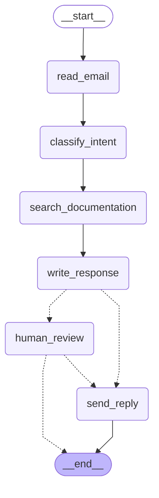

LangGraph can change how you think about the agents you build. When you build an agent with LangGraph, you will first break it apart into discrete steps called **nodes**. Then, you will describe the different decisions and transitions for each of your nodes. Finally, you will connect your nodes together with a shared **state** that flows through them. In this tutorial, we'll guide you through the thought process of building a customer support email agent with LangGraph.

## Start with the process you want to automate

Imagine that you need to build an AI agent that handles customer support emails. Your product team has given you these requirements:

**The agent should:**

- Read incoming customer emails
- Classify them by urgency and topic
- Search relevant documentation to answer questions
- Draft appropriate responses
- Escalate complex issues to human agents
- Schedule follow-ups when needed

**Example scenarios to handle:**

1. **Simple product question**: "How do I reset my password?"
2. **Bug report**: "The export feature crashes when I select PDF format"
3. **Urgent billing issue**: "I was charged twice for my subscription!"
4. **Feature request**: "Can you add dark mode to the mobile app?"
5. **Complex technical issue**: "Our API integration fails intermittently with 504 errors"

To implement an agent in LangGraph, you will usually follow the same five steps.

## Step 1: Map out your workflow as discrete steps

Start by identifying the distinct steps in your process. Each step will become a **node** (a function that does one specific thing). Then sketch how these steps connect to each other.

```
     ┌─────────────┐
     │   START     │
     └──────┬──────┘
            ↓
     ┌─────────────┐
     │ Read Email  │
     └──────┬──────┘
            ↓
     ┌─────────────┐
     │  Classify   │
     │   Intent    │ ──────────┐
     └──────┬──────┘           │
           ╱ ╲                 │
          ╱   ╲                │
         ╱     ╲               ↓
   ┌────────┐ ┌────────┐ ┌────────┐
   │  Doc   │ │  Bug   │ │ Human  │
   │ Search │ │ Track  │ │ Review │
   └────┬───┘ └────┬───┘ └────┬───┘
        ╲         ╱            │
         ╲       ╱             │
     ┌─────────────┐           │
     │Draft Reply  │ ──────────┘
     └──────┬──────┘
           ╱ ╲
          ╱   ╲
   ┌────────┐ ┌────────┐
   │ Human  │ │  Send  │
   │ Review │ │ Reply  │
   └────┬───┘ └────┬───┘
        │          │
        ↓          ↓
     ┌─────────────┐
     │     END     │
     └─────────────┘

```



The arrows show possible paths, but the actual decision of which path to take happens inside each node using Command.

Now that you've identified the components in your workflow, let's understand what each node needs to do:

- **Read Email**: Extract and parse the email content
- **Classify Intent**: Use an LLM to categorize urgency and topic, then route to appropriate action
- **Doc Search**: Query your knowledge base for relevant information
- **Bug Track**: Create or update issue in tracking system
- **Draft Reply**: Generate an appropriate response
- **Human Review**: Escalate to human agent for approval or handling
- **Send Reply**: Dispatch the email response

Notice that some nodes make decisions about where to go next (Classify Intent, Draft Reply, Human Review), while others always proceed to the same next step (Read Email always goes to Classify Intent, Doc Search always goes to Draft Reply).

## Step 2: Identify what each step needs to do

For each node in your graph, determine what type of operation it represents and what context needs to work properly.

### LLM Steps

When a step needs to understand, analyze, generate text, or make reasoning decisions:

**Classify Intent Node:**

- **Static context (prompt)**: Classification categories, urgency definitions, response format
- **Dynamic context (from state)**: Email content, sender information
- **Desired outcome**: Structured classification that determines routing

**Draft Reply Node:**

- **Static context (prompt)**: Tone guidelines, company policies, response templates
- **Dynamic context (from state)**: Classification results, search results, customer history
- **Desired outcome**: Professional email response ready for review

### Data Steps

When a step needs to retrieve information from external sources:

**Doc Search Node:**

- **Parameters**: Query built from intent and topic
- **Retry strategy**: Yes, with exponential backoff for transient failures
- **Caching**: Could cache common queries to reduce API calls

**Customer History Lookup:**

- **Parameters**: Customer email or ID from state
- **Retry strategy**: Yes, but with fallback to basic info if unavailable
- **Caching**: Yes, with time-to-live to balance freshness and performance

### Action Steps

When a step needs to perform an external action:

**Send Reply Node:**

- **When to execute**: After approval (human or automated)
- **Retry strategy**: Yes, with exponential backoff for network issues
- **Should not cache**: Each send is a unique action

**Bug Track Node:**

- **When to execute**: Always when intent is "bug"
- **Retry strategy**: Yes, critical to not lose bug reports
- **Returns**: Ticket ID to include in response

### User Input Steps

When a step needs human intervention:

**Human Review Node:**

- **Context for decision**: Original email, draft response, urgency, classification
- **Expected input format**: Approval boolean plus optional edited response
- **When triggered**: High urgency, complex issues, or quality concerns

Note: When combining user input with other operations in the same node, always put the `interrupt()` call first. Any code before it will re-run when the graph resumes.

## Step 3: Design your state

State is the shared memory that flows through your agent. Think of it as the notebook your agent uses to keep track of everything it learns and decides as it works through the process.

### What belongs in state?

Ask yourself these questions about each piece of data:

- **Does it need to persist across steps?** If yes, it goes in state.
- **Can you derive it from other data?** If yes, compute it when needed instead of storing it.

For our email agent, we need to track:

- The original email and sender info (can't reconstruct these)
- Classification results (needed by multiple downstream nodes)
- Search results and customer data (expensive to re-fetch)
- The draft response (needs to persist through review)
- Execution metadata (for debugging and recovery)

### Keep state raw, format prompts on-demand

A key principle: your state should store raw data, not formatted text. Format prompts inside nodes when you need them. This separation means:

- Different nodes can format the same data differently for their needs
- You can change prompt templates without modifying your state schema
- Debugging is clearer - you see exactly what data each node received
- Your agent can evolve without breaking existing state

Let's define our state:

```python
from typing import TypedDict, Literal

# Define the structure for email classification
class EmailClassification(TypedDict):
    intent: Literal["question", "bug", "billing", "feature", "complex"]
    urgency: Literal["low", "medium", "high", "critical"]
    topic: str
    summary: str

class EmailAgentState(TypedDict):
    # Raw email data
    email_content: str
    sender_email: str
    email_id: str

    # Classification result
    classification: EmailClassification | None

    # Raw search/API results
    search_results: list[str] | None  # List of raw document chunks
    customer_history: dict | None  # Raw customer data from CRM

    # Generated content
    draft_response: str | None
```

Notice that the state contains only raw data - no prompt templates, no formatted strings, no instructions. The classification output is stored as a single dictionary, straight from the LLM.

## Step 4: Build your nodes

Now we implement each step as a function. A node in LangGraph is just a Python function that takes the current state and returns updates to it.

### Handle errors appropriately

Different errors need different handling strategies:

**Transient errors (network issues, rate limits)** - Add a retry policy to automatically retry:

```python
from langgraph.types import RetryPolicy

workflow.add_node(
    "search_documentation",
    search_documentation,
    retry_policy=RetryPolicy(max_attempts=3, initial_interval=1.0)
)
```

**LLM-recoverable errors (tool failures, parsing issues)** - Store the error in state and loop back:

```python
def execute_tool(state: State) -> Command[Literal["agent", "execute_tool"]]:
    try:
        result = run_tool(state['tool_call'])
        return Command(update={"tool_result": result}, goto="agent")
    except ToolError as e:
        # Let the LLM see what went wrong and try again
        return Command(
            update={"tool_result": f"Tool error: {str(e)}"},
            goto="agent"
        )
```

**User-fixable errors (missing credentials, unclear instructions)** - Pause and ask for help:

```python
def api_call(state: State) -> Command[Literal["continue"]]:
    if not state.get('api_key'):
        user_input = interrupt({
            "error": "API key missing",
            "request": "Please provide your API key"
        })
        return Command(
            update={"api_key": user_input['api_key']},
            goto="continue"
        )
```

**Unexpected errors** - Let them bubble up for debugging. Don't catch what you can't handle.

### Implementing our email agent nodes

```python
from typing import Literal
from langgraph.graph import StateGraph, START, END
from langgraph.types import interrupt, Command
from langgraph.pregel import RetryPolicy
from langchain_openai import ChatOpenAI
from langchain_core.messages import HumanMessage

llm = ChatOpenAI(model="gpt-4")

def read_email(state: EmailAgentState) -> dict:
    """Extract and parse email content"""
    # In production, this would connect to your email service
    return {
        "messages": [HumanMessage(content=f"Processing email: {state['email_content']}")]
    }

def classify_intent(state: EmailAgentState) -> Command[Literal["search_documentation", "human_review", "draft_response", "bug_tracking"]]:
    """Use LLM to classify email intent and urgency, then route accordingly"""

    # Create structured LLM that returns EmailClassification dict
    structured_llm = llm.with_structured_output(EmailClassification)

    # Format the prompt on-demand, not stored in state
    classification_prompt = f"""
    Analyze this customer email and classify it:

    Email: {state['email_content']}
    From: {state['sender_email']}

    Provide classification including intent, urgency, topic, and summary.
    """

    # Get structured response directly as dict
    classification = structured_llm.invoke(classification_prompt)

    # Determine next node based on classification
    if classification['intent'] == 'billing' or classification['urgency'] == 'critical':
        goto = "human_review"
    elif classification['intent'] in ['question', 'feature']:
        goto = "search_documentation"
    elif classification['intent'] == 'bug':
        goto = "bug_tracking"
    else:
        goto = "draft_response"

    # Store classification as a single dict in state
    return Command(
        update={"classification": classification},
        goto=goto
    )

def search_documentation(state: EmailAgentState) -> Command[Literal["draft_response"]]:
    """Search knowledge base for relevant information"""

    # Build search query from classification
    classification = state.get('classification', {})
    query = f"{classification.get('intent', '')} {classification.get('topic', '')}"

    try:
        # Implement your search logic here
        # Store raw search results, not formatted text
        search_results = [
            "Reset password via Settings > Security > Change Password",
            "Password must be at least 12 characters",
            "Include uppercase, lowercase, numbers, and symbols"
        ]
    except SearchAPIError as e:
        # For recoverable search errors, store error and continue
        search_results = [f"Search temporarily unavailable: {str(e)}"]

    return Command(
        update={"search_results": search_results},  # Store raw results or error
        goto="draft_response"
    )

def bug_tracking(state: EmailAgentState) -> Command[Literal["draft_response"]]:
    """Create or update bug tracking ticket"""

    # Create ticket in your bug tracking system
    ticket_id = "BUG-12345"  # Would be created via API

    return Command(
        update={
            "search_results": [f"Bug ticket {ticket_id} created"],
            "current_step": "bug_tracked"
        },
        goto="draft_response"
    )

def draft_response(state: EmailAgentState) -> Command[Literal["human_review", "send_reply"]]:
    """Generate response using context and route based on quality"""

    classification = state.get('classification', {})

    # Format context from raw state data on-demand
    context_sections = []

    if state.get('search_results'):
        # Format search results for the prompt
        formatted_docs = "\n".join([f"- {doc}" for doc in state['search_results']])
        context_sections.append(f"Relevant documentation:\n{formatted_docs}")

    if state.get('customer_history'):
        # Format customer data for the prompt
        context_sections.append(f"Customer tier: {state['customer_history'].get('tier', 'standard')}")

    # Build the prompt with formatted context
    draft_prompt = f"""
    Draft a response to this customer email:
    {state['email_content']}

    Email intent: {classification.get('intent', 'unknown')}
    Urgency level: {classification.get('urgency', 'medium')}

    {chr(10).join(context_sections)}

    Guidelines:
    - Be professional and helpful
    - Address their specific concern
    - Use the provided documentation when relevant
    """

    response = llm.invoke(draft_prompt)

    # Determine if human review needed based on urgency and intent
    needs_review = (
        classification.get('urgency') in ['high', 'critical'] or
        classification.get('intent') == 'complex'
    )

    # Route to appropriate next node
    goto = "human_review" if needs_review else "send_reply"

    return Command(
        update={"draft_response": response.content},  # Store only the raw response
        goto=goto
    )

def human_review(state: EmailAgentState) -> Command[Literal["send_reply", END]]:
    """Pause for human review using interrupt and route based on decision"""

    classification = state.get('classification', {})

    # interrupt() must come first - any code before it will re-run on resume
    human_decision = interrupt({
        "email_id": state['email_id'],
        "original_email": state['email_content'],
        "draft_response": state['draft_response'],
        "urgency": classification.get('urgency'),
        "intent": classification.get('intent'),
        "action": "Please review and approve/edit this response"
    })

    # Now process the human's decision
    if human_decision.get("approved"):
        return Command(
            update={"draft_response": human_decision.get("edited_response", state['draft_response'])},
            goto="send_reply"
        )
    else:
        # Rejection means human will handle directly
        return Command(update={}, goto=END)

def send_reply(state: EmailAgentState) -> dict:
    """Send the email response"""
    # Integrate with email service
    print(f"Sending reply: {state['draft_response'][:100]}...")
    return {}
```

## Step 5: Wire it together

Now we connect our nodes into a working graph. Since our nodes handle their own routing decisions, we only need a few essential edges.

To enable human-in-the-loop with `interrupt()`, we need a checkpointer to save state:

```python
from langgraph.checkpoint.memory import MemorySaver
from langgraph.pregel import RetryPolicy

# Create the graph
workflow = StateGraph(EmailAgentState)

# Add nodes with appropriate error handling
workflow.add_node("read_email", read_email)
workflow.add_node("classify_intent", classify_intent)

# Add retry policy for nodes that might have transient failures
workflow.add_node(
    "search_documentation",
    search_documentation,
    retry_policy=RetryPolicy(max_attempts=3)
)
workflow.add_node("bug_tracking", bug_tracking)
workflow.add_node("draft_response", draft_response)
workflow.add_node("human_review", human_review)
workflow.add_node("send_reply", send_reply)

# Add only the essential edges
workflow.add_edge(START, "read_email")
workflow.add_edge("read_email", "classify_intent")
workflow.add_edge("send_reply", END)

# Compile with checkpointer for persistence
memory = MemorySaver()
app = workflow.compile(checkpointer=memory)
```

The graph structure is minimal because routing happens inside nodes through `Command` objects. Each node declares where it can go using type hints like `Command[Literal["node1", "node2"]]`, making the flow explicit and traceable.

### Try out your agent

Let's run our agent with an urgent billing issue that needs human review:

```python
# Test with an urgent billing issue
initial_state = {
    "email_content": "I was charged twice for my subscription! This is urgent!",
    "sender_email": "customer@example.com",
    "email_id": "email_123",
    "messages": []
}

# Run with a thread_id for persistence
config = {"configurable": {"thread_id": "customer_123"}}
result = app.invoke(initial_state, config)
# The graph will pause at human_review
print(f"Draft ready for review: {result['draft_response'][:100]}...")

# When ready, provide human input to resume
from langgraph.types import Command

human_response = Command(
    resume={
        "approved": True,
        "edited_response": "We sincerely apologize for the double charge. I've initiated an immediate refund..."
    }
)

# Resume execution
final_result = app.invoke(human_response, config)
print(f"Email sent successfully!")
```

The graph pauses when it hits `interrupt()`, saves everything to the checkpointer, and waits. It can resume days later, picking up exactly where it left off. The thread_id ensures all state for this conversation is preserved together.

## Where to go from here

This was an introduction to thinking about building agents with LangGraph. You can extend this foundation with:

- **Enhanced human-in-the-loop patterns**:
    - Tool approval before execution
    - Batch approval for multiple actions
- **Create subgraphs** for complex multi-step operations
- **Add streaming** to show real-time progress to users
- **Integrate more tools** for web search, database queries, and API calls
- **Implement retry logic** with exponential backoff for failed operations
- **Add observability** with LangSmith for debugging and monitoring

## Key Insights

Building this email agent has shown us the LangGraph way of thinking:

**Break complex processes into discrete steps.** Each node does one thing well. This decomposition enables streaming progress updates, durable execution that can pause and resume, and clear debugging since you can inspect state between steps.

**State flows through your graph like a shared notebook.** Store raw data, not formatted text. This lets different nodes use the same information in different ways.

**Nodes are just functions.** They take state, do work, and return updates. When they need to make routing decisions, they specify both the state updates and the next destination.

**Errors are part of the flow.** Transient failures get retries, LLM-recoverable errors loop back with context, user-fixable problems pause for input, and unexpected errors bubble up for debugging.

**Human input is a first-class concept.** The `interrupt()` function pauses execution indefinitely, saves all state, and resumes exactly where it left off when you provide input. When combined with other operations in a node, it must come first.

The graph structure emerges naturally from your process. You define the essential connections, and your nodes handle their own routing logic. This keeps control flow explicit and traceable - you can always understand what your agent will do next by looking at the current node.
